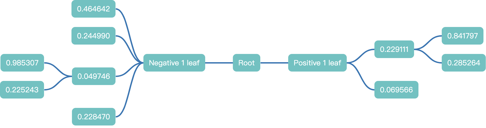

# bade-mind-react

**`bade-mind`** React 框架封装库

- **实现**了节点的`sizeof`函数，能够自动测量节点尺寸，并添加缓存功能

- **增加**滚动条交互

- **增加**滚轮手势交互

- **实现**拖动功能

- 当前**内置布局暂时只有**`BadeMind.ChildAlignMode.heirCenter`布局算法支持拖拽功能

## Installation

### NPM

```shell
npm install bade-mind-react
```

## Usage

```tsx
import * as React from 'react'
import { useState } from 'react'
import ReactDom from 'react-dom'

import { BadeMind, BadeMindReact } from 'bade-mind-react'

const root: BadeMind.Root = {
  negative: [
    {
      attachData: 'Negative 1 leaf',
      id: 'n-1-l'
    }
  ],
  node: {
    attachData: 'Root',
    id: 'root'
  },
  positive: [
    {
      attachData: 'Positive 1 leaf',
      id: 'p-1-l'
    }
  ]
}

const generateChildren = () => {
  const result: BadeMindReact.Node[] = []
  const num = Math.ceil(3 * Math.random())
  for (let counter = 0; counter < num; counter++) {
    result.push({
      attachData: Math.random().toFixed(6),
      draggable: true,
      id: Math.random().toString()
    })
  }
  return result
}

const Render = (props: {
  node: BadeMind.Node
  onClick: (e: React.MouseEvent<HTMLDivElement, MouseEvent>) => void
}) => {
  const { node, onClick } = props
  return (
    <div className={'node'} onClick={onClick}>
      {node.attachData}
    </div>
  )
}

const options: BadeMind.Options = {
  nodeSeparate: 20,
  rankSeparate: 60
}

const Demo = () => {
  const [data, setData] = useState<BadeMind.Root>(root)
  const [anchor, setAnchor] = useState<string | undefined>()

  // 拖动结束事件
  const onDragEnd = useCallback<BadeMindReact.DragEndEvent>(
    (event) => {
      const { attach, node, original } = event
      if (attach && attach.index >= 0) {
        let children: BadeMindReact.Node[] = []
        // 如果为根节点
        if (attach.parent.id === data.node.id) {
          if (attach.orientation === BadeMind.Orientation.positive) {
            children = data.positive = data.positive || []
          } else {
            children = data.negative = data.negative || []
          }
        } else {
          children = attach.parent.children = attach.parent.children || []
        }

        // 插入到对应位置
        // ... 创建新对象插入(避免在同一父级下拖拽，后续删除无法辨别旧节点的情况)
        children.splice(attach.index, 0, {
          ...node
        })

        let originalPlaceNodes = []
        // 原始父节点为根节点
        if (original.parent.id === data.node.id) {
          originalPlaceNodes =
            original.orientation === BadeMind.Orientation.positive ? data.positive : data.negative
        } else {
          originalPlaceNodes = original.parent.children
        }
        const dragNodeIndex = originalPlaceNodes.indexOf(node)

        if (dragNodeIndex >= 0) {
          originalPlaceNodes.splice(dragNodeIndex, 1)
        }

        setAnchor(attach.parent.id)
        setData((pre) => ({ ...pre }))
      }
    },
    [data]
  )

  return (
    <BadeMindReact.Graphic
      data={data}
      anchor={anchor}
      scrollbar={true}
      onDragEnd={onDragEnd}
      render={(node) => (
        <Render
          node={node}
          onClick={(e) => {
            setAnchor(node.id)
            if (node.id !== root.node.id) {
              if (!node.children) {
                node.children = []
              }
              node.children.push(...generateChildren())
              setData((pre) => {
                return { ...pre }
              })
            }
          }}
        />
      )}
      options={options}
    />
  )
}
ReactDom.render(<Demo />, document.getElementById('root'))
```

**Result**



## Export

### BadeMind

组件依赖的`bade-mind`库导出

### BadeMindReact

#### Node

组件内部已自动实现`sizeof`函数，故而不需要用户配置

```tsx
interface Node extends Omit<BadeMind.Node, 'sizeof' | 'children'> {
    /**
     * 当设置 size 时，将会禁止自动测量，提升速率
     */
    size?: BadeMind.Size
    /**
     * 节点是否受到保护（超出可视区域不会被销毁，但会设置`visible=hidden`）
     * @default false
     */
    beProtected?: boolean
    /**
     * 节点总是可见（超出可视区域不会被销毁也不会改变`visible`状态）
     * @default false
     */
    alwaysVisible?: boolean
    /**
     * 禁用尺寸缓存
     * @default false
     */
    disableSizeCache?: boolean
    /**
     * 子代节点
     */
    children?: Node[]
    /**
     * 节点是否可拖拽
     * - 需要当前布局算法支持拖拽
     * @default false
     */
    draggable?: boolean
    /**
     * 节点是否可被拖拽节点依附作为其子节点
     * @default true
     */
    droppable?: boolean
}
```

#### Root

```tsx
interface Root {
    node: Node
    positive?: Node[]
    negative?: Node[]
}
```

#### GraphicProps

```tsx
export interface GraphicProps {
    /**
     * bade mind 配置项
     * - 做浅比较，引用出现改变则重新绘制
     */
    options?: BadeMind.Options
    /**
     * 脑图结构数据
     * - 做浅比较，引用出现改变则重新绘制
     * - html 值将由组件自动注入到对象中（不改变对象引用，只是注入值）
     * - 如果节点**长宽固定值**，则，请直接设置 size，避免性能损耗
     */
    data: Root
    /**
     * 节点渲染器
     * - 做浅比较，引用出现改变则重新绘制
     * - 请在节点**第一次渲染时就确定其尺寸**，当节点尺寸改变时，需要修改`data`引用，唤起重计算
     * - 请保持镜像节点尺寸与源节点尺寸一致
     * @param data 节点数据
     * @param mirror 渲染节点是否为镜像节点（拖拽）
     */
    render: Render
    /**
     * 渲染锚点数据
     * - 在启动重渲染时保持 anchor 对应节点在屏幕上的相对位置不变
     */
    anchor?: string
    /**
     * 是否展示滚动条
     * - 当展示滚动条时，将会自动限定位移区域
     * - 当隐藏滚动条时，位移范围无限制
     * @default false
     */
    scrollbar?: boolean
    /**
     * 图形更新完成
     * - 由 data 和 options 改变所引起，脑图控制对象内部状态刷新
     * - 即，此时，脑图所有的状态以及渲染已经完成
     * @param mind 脑图控制对象
     */
    onUpdated?: (mind: BadeMind.Graphic) => void
    /**
     * 注入到根上的 `class`
     */
    className?: string
    /**
     * 注入到根上的 `style`
     */
    style?: React.CSSProperties
    /**
     * 滚轮移动速度
     * @default 0.5
     */
    wheelMoveSpeed?: number
    /**
     * 拖拽开始事件
     * @param node 拖拽的节点
     */
    onDragStart?: DragStartEvent
    /**
     * 拖拽中事件
     * @param event.node 拖拽的节点
     * @param event.attach 拖拽节点关联的节点（关联父级），可能为空
     * @param event.position 拖拽节点镜像中心当前位置
     * @param event.orientation 拖拽节点当前位于哪个区域（位于根节点区域时为空，此时无法附着在任何一个节点上）
     */
    onDrag?: DragEvent
    /**
     * 拖拽结束事件
     * @param event.node 拖拽的节点
     * @param event.attach 拖拽节点最终关联的节点（关联父级），可能为空
     * @param event.orientation 拖拽节点当前最终位于哪个区域（位于根节点区域时为空，此时无法附着在任何一个节点上）
     * @param event.id 拖拽节点位于最终关联节点子代（关联父级）中的目标位置（-1代表无需改变位置）（需要注意的是，关联的父节点可能仍然是拖动节点自身的父节点）
     */
    onDragEnd?: DragEndEvent
}
```

#### GraphicRef

```tsx
interface GraphicRef {
    mind?: BadeMind.Graphic
}
```

#### Render

```tsx
type Render = (data: Node, mirror: boolean) => React.ReactNode 
```

#### DragStartEvent

```tsx
type DragStartEvent = (event: { node: Node }) => void
```

#### DragEvent

```tsx
type DragEvent = (event: {
    node: Node
    attach:
    | {
      parent: Node
      orientation: BadeMind.Orientation
    }
    | undefined
    mirrorPosition: BadeMind.Coordinate
}) => void
```

#### DragEndEvent

```tsx
type DragEndEvent = (event: {
    node: Node
    attach:
    | {
      parent: Node
      orientation: BadeMind.Orientation
      index: number
    }
    | undefined
    original: {
      parent: Node
      orientation: BadeMind.Orientation
    }
}) => void
```

## Tips

### 渲染初始定位

可使用`onUpdated`在渲染完成之后，改变位移缩放等

- 谨记，`onUpdated`会在每一次渲染更新完成之后调用

```tsx
onUpdated={(mind) => {
    // 如果只需要初次渲染修改位移，则需要在此处做逻辑判断处理
    // 将root移动到viewport上中
    mind.nodeTranslateTo({
        diff: {
            x: 0,
            y: 0
        },
        id: 'root',
        relative: {
            x: BadeMind.RelativeX.middle,
            y: BadeMind.RelativeY.top
        }
    })
}
```
