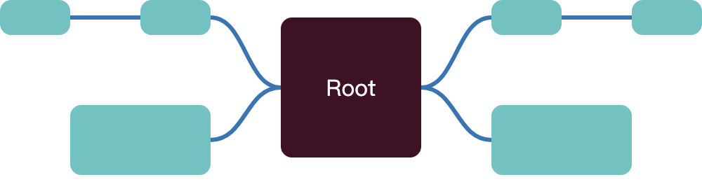

# bade-mind

**Bade** 思维导图核心，提供绘制所需必要工具功能，不依赖于特定框架

## Installation

### NPM

```shell
npm install bade-mind
```

## Usage

- 库本身并**不负责node内容的渲染**，其只会渲染链接线以及管理手势系统，计算布局等

- 在使用的时候，需要用户根据使用框架、环境**自行实现节点的`sizeof`函数**，此函数用作获取某个节点的dom尺寸，并会在**每一次渲染的时候调用**，用于计算布局

- 需要注意的是，**普通节点**的子代通过`children`设置，但**根节点的`children`会被忽略**，需要通过`root.positive`或`root.negative`来设置

### Simple demo

**Html**

```html
<!DOCTYPE html>
<html lang="en">
<head>
    <meta charset="UTF-8" />
    <meta http-equiv="X-UA-Compatible" content="IE=edge" />
    <meta name="viewport" content="width=device-width, initial-scale=1.0" />
    <title>bade-mind demo</title>
    <style>
        body,#root{
            position: fixed;
            left: 0;
            top: 0;
            width: 100%;
            height: 100%;
        }

        #container{
            position: relative;
            width: fit-content;
            height: fit-content;
        }

        #node-container{
            position: absolute;
            left: 0;
            top: 0;
        }

        /* 定义链接线样式 */
        .bade-mind__lines{
            stroke: #2775b6;
            stroke-width: 3px;
        }

        .node{
            position: absolute;
            left: 0;
            top: 0;
        }

        .node-content{
            background: #57c3c2;
            border-radius: 8px;
            display: flex;
            align-items: center;
            justify-content: center;
        }

        .root-node{
            color: white;
            background: #440e25;
        }
    </style>
</head>
<body>
<div id="root">
    <div id="container">
        <div id="node-container"></div>
    </div>
</div>
</body>
</html>
```

**Simple data**

```tsx
const rootHtml = `<div class="node-content root-node" style="width: 100px;height: 100px;box-sizing: content-box;">Root</div>`

// 简单测量html字符串内容尺度
export const measureSize = (html: string, viewport: HTMLElement) => {
  const size: BadeMind.Size = {
    height: 0,
    width: 0
  }
  const container = document.createElement('div')
  // 将内容脱离文档流并且完全隐藏起来
  container.style.cssText =
    'position:fixed;top:0;left:0;pointer-events:none;visibility:hidden;opacity:0;overflow:hidden;'
  container.innerHTML = html
  viewport.appendChild(container)
  size.width = container.clientWidth
  size.height = container.clientHeight

  // 测量完成移除
  viewport.removeChild(container)

  return size
}

const generateRoot = (viewport: HTMLElement): BadeMind.Root => ({
  negative: [
    {
      children: [
        {
          id: 'n-2-l',
          sizeof: () => ({
            height: 25,
            width: 50
          })
        }
      ],
      id: 'n-1-w-c',
      sizeof: () => ({
        height: 25,
        width: 50
      })
    },
    {
      id: 'n-1-l',
      sizeof: () => ({
        height: 50,
        width: 100
      })
    }
  ],
  node: {
    id: 'root',
    sizeof: () => measureSize(rootHtml, viewport)
  },
  positive: [
    {
      children: [
        {
          id: 'p-2-l',
          sizeof: () => ({
            height: 25,
            width: 50
          })
        }
      ],
      id: 'p-1-w-c',
      sizeof: () => ({
        height: 25,
        width: 50
      })
    },
    {
      id: 'p-1-l',
      sizeof: () => ({
        height: 50,
        width: 100
      })
    }
  ]
})
```

**Logic**

```tsx
window.onload = () => {
  const viewport = document.getElementById('root')!
  const container = document.getElementById('container')
  const nodeContainer = document.getElementById('node-container')
  let graphic: BadeMind.Graphic | undefined = undefined
  const root = generateRoot(viewport)

  graphic = new BadeMind.Graphic(viewport, container, {
    callback: {
      onNodeVisibleChange: (nodes) => {
        nodeContainer.innerHTML = nodes
          .map((node) => {
            const anchor = graphic.getNodeAnchorCoordinate(node.id)
            let content = ''
            if (node.id === root.node.id) {
              content = rootHtml
            } else {
              content = `<div class="node-content" style="width: ${node.sizeof().width}px;height: ${
                node.sizeof().height
              }px;"></div>`
            }

            return `<div class="node" style="transform: translateX(${anchor.x}px) translateY(${anchor.y}px)">${content}</div>`
          })
          .join('')
      }
    },
    childAlignMode: BadeMind.ChildAlignMode.structured,
    lineStyle: BadeMind.LinkStyle.line,
    pathRender: (context) => {
      const { source, target } = context
      return `M${source.x},${source.y}L${target.x},${target.y}`
    }
  })

  graphic.setData(root)
}
```

**Result**



## API

### Graphic

脑图绘制控制类

#### constructor

```tsx
constructor(
    viewport: HTMLElement,
    container: HTMLElement,
    options?: BadeMind.Options
)
```

- **param** **`viewport`** 视窗（可视区域）

- **param** **`container`** 容器
  
  - svg链接线将会自动注入到container中
  
  - `transform` 相关信息将会自动注入到`container`中

- **param** **`options`** 配置参数

#### judgeNodeVisible

判断节点是否可视

```tsx
function judgeNodeVisible(id: string): boolean
```

- **param** **`id`** 节点`id`

- **return** 当前节点是否可见（寻找不到对应节点时也返回`false`）

#### getNodeAnchorCoordinate

获取节点定位锚点（左上角）位置，可在节点绘制的时候确定其位置

- 推荐使用`position:absolute;left:0;top:0;`配合`transform`来定位，避免出现绘制异常

```tsx
function getNodeAnchorCoordinate(id: string): BadeMind.Coordinate | undefined
```

- **param** **`id`** 节点`id`

- **return** 锚点坐标（寻找不到对应节点时返回`undefined`）

#### getLayoutSize

获取渲染层尺寸

```tsx
function getLayoutSize(): BadeMind.Size | undefined
```

#### getNode

获取`id`对应节点

```tsx
function getNode(id: string): BadeMind.Node | undefined
```

#### getParent

获取`id`对应节点父级

```tsx
function getParent(id: string): BadeMind.Node | undefined
```

#### getNodeOrientation

获取`id`对应节点渲染方位

```tsx
function getNodeOrientation(id: string): BadeMind.Orientation | undefined
```

#### dragControllerBuilder

生成拖动控制器

- 根节点不可拖拽
- 当前**内置布局方式暂时只有**`BadeMind.ChildAlignMode.structured`布局算法支持拖拽功能

```tsx
function dragControllerBuilder(drag: BadeMind.Node | string): Drag | undefined
```

- **param** **`drag`** 拖动节点node对象或id

- **return** 
  
  - 当root（没有调用`setData`）不存在时，或者`drag`为根节点时，返回`undefined`
  
  - 正常情况返回 `Drag` 类对象

#### unbind

注销事件绑定

```tsx
function unbind(): void
```

#### setOptions

设定 `options`

- 不会自动执行重渲染，如果改变的`options`需要**重新计算布局**等操作，推荐使用 `setData` 驱动数据重渲染

```tsx
function setOptions(
    options?: BadeMind.Options,
    isMerge: boolean = false): void
```

- **param** **`options`** 设定选项

- **param** **`isMerge`** 是否与之前的`options`做合并操作

#### setTransform

主动设置位移缩放

- 会与之前的`transform`做深度合并

- 请注意：`setTransform` 之后 `onTransformChange` 事件依旧会触发

- 此方法不受 `zoomExtent.translate` 限制

```tsx
function setTransform(
    transform: Partial<BadeMind.Transform>,
    duration?: number): void
```

- **param** **`transform`** 位移缩放数据

- **param** **`duration`** 周期，如果配置，则执行变换会附带动画效果

#### scale

缩放

- 此方法受到 `zoomExtent.translate` 限制

- 此方法受到 `zoomExtent.scale` 限制

```tsx
function scale(
    scale: number,
    point?: BadeMind.Coordinate,
    duration?: number): void
```

- **param** **`transform`** 缩放值

- **param** **`point`** 缩放相对点（如不配置或为`undefined`，则默认相对于`viewport`中心缩放）

- **param** **`duration`** 周期，如果配置，则执行变换会附带动画效果

#### translate

位移

- 此方法受到 `zoomExtent.translate` 限制

```tsx
function translate(
    translate: BadeMind.Coordinate,
    duration?: number): void
```

- **param** **`translate`** 位移差(屏幕尺度)

- **param** **`duration`** 周期，如果配置，则执行变换会附带动画效果

#### nodeTranslateTo

将某一个节点中心从某个相对位置做位移（其尺度为屏幕尺度）操作

- 此方法不受 `zoomExtent.translate` 限制

```tsx
function nodeTranslateTo(
    config: {
        id: string,
        diff: BadeMind.Coordinate,
        relative: BadeMind.Relative
    },
    duration?: number): void
```

- **param** **`config`** 配置参数

- **param** **`config.id`** 节点id

- **param** **`config.diff`** 位移差

- **param** **`config.relative`** 相对位置

- **param** **`duration`** 动画周期，如配置，则位移会附带动画效果

#### getTransform

获取位移缩放信息

```tsx
function getTransform(): BadeMind.Transform
```

#### setAnchor

设置锚点

```tsx
function setAnchor(id?: string): void
```

- **param** **`id`** 锚定节点id

#### setData

设置/更新数据，启动重渲染

- 在重计算定位时，将保持 `anchor` 对应节点在屏幕上的相对位置不变
- 如果 `anchor` 没有设定，或者找不到对应节点，则，根节点居中，缩放比重置为1

```tsx
function setData(root: BadeMind.Root): void
```

- **param** **`root`** 根数据

## Drag

拖动控制器

- 推荐使用`Graphic.dragControllerBuilder`生成，自动注入所需数据

### constructor

```tsx
constructor(context: {
    options: Required<BadeMind.Options>, 
    cacheMap: BadeMind.CacheMap, 
    root: BadeMind.Root, 
    maxDistance: number,
    dragNode: BadeMind.Node
    container: HTMLElement
})
```

### calcDropIndex

获取拖动节点插入到关联节点子代的下标

- 如果**父级改变**，则为期望插入位置下标，直接插入子代中即可

- 如果**父级未变**，则需要先使用下标插入到对应位置之后，删除原先的节点

```tsx
function calcDropIndex(
     attachedNodeChildren: BadeMind.Node[] | undefined,
     dropPosition: BadeMind.Coordinate,
     dragNode: BadeMind.Node,
     attachedNode: BadeMind.Node): number
```

- **param** **`attachedNodeChildren`** 关联节点的子代

- **param** **`dropPosition`** 拖动节点镜像中心位置

- **param** **`dragNode`** 拖动节点

- **param** **`attachedNode`** 被关联的节点

- **return** 期望插入位置

### drag

拖动操作

- 根节点不可拖拽

```tsx
function drag(position: BadeMind.Coordinate,canBeAttachedNodes: BadeMind.Node[]): {
    orientation: "negative" | "positive", 
    attach: BadeMind.Node
} | undefined
```

- **param** **`position`** 拖动节点镜像中心位置

- **param** **`canBeAttachedNodes`** 需要搜索的可关联节点

- **return** 链接关联信息
  
  - 如没有合法的链接节点，则返回`undefined`
  
  - `orientation`代表拖拽节点链接到目标节点的相对区域
  
  - `attach`为拖拽节点依附的目标节点

### end

通知控制器拖动操作结束

```tsx
function end(): void
```

## Types

### Size

```tsx
interface Size {
    width: number
    height: number
}
```

### Coordinate

```tsx
interface Coordinate {
    x: number
    y: number
} 
```

### Root

```tsx
interface Root {
    /**
     * 根节点数据
     */
    node: Omit<Node, 'children'>
    /**
     * 正向区域节点
     */
    positive?: Node[]
    /**
     * 负向区域节点
     */
    negative?: Node[]
}
```

### Options

```tsx
export interface Options {
    /**
     * 渲染方向
     * - positive 在 x 模式下渲染在右侧，y 模式下渲染在上侧
     * - negative 在 x 模式下渲染在左侧，y 模式下渲染在下侧
     * @default 'x' 水平方向
     */
    direction?: Direction
    /**
     * 节点间距
     * @default 50
     */
    nodeSeparate?: number
    /**
     * 每一级的距离
     * @default 50
     */
    rankSeparate?: number
    /**
     * 子代对齐模式(布局模式)
     * @default 'structured'
     */
    childAlignMode?: ChildAlignMode
    /**
     * 视窗四周预加载尺寸
     * @default 0
     */
    viewportPreloadPadding?: number
    /**
     * 回调
     */
    callback?: Callback
    /**
     * 事件
     */
    event?: Event
    /**
     * 连线样式风格
     * @default 'bezier'
     */
    lineStyle?: LinkStyle
    /**
     * 自定义path渲染路径
     * - 优先级高于 `lineStyle`
     * @param data
     * @return 返回字符串将作为 path d 属性
     */
    pathRender?: PathRender | undefined
    /**
     * 缩放尺度控制
     */
    zoomExtent?: ZoomExtent
    /**
     * 自定义布局处理器
     * - 优先级高于 childAlignMode 选择的布局方式
     */
    layoutProcess?: { new (): Process.Lifecycle }
  }
```

### Node

节点信息

```tsx
interface Node {
    /**
     * 获取当前节点尺寸
     */
    sizeof: () => Size
    /**
     * 全局唯一 id
     */
    id: string
    /**
     * 子代
     */
    children?: Node[]
    /**
     * 是否折叠子代
     * - 根节点为数组，[negative,positive]
     * - 普通节点直接代表是否折叠子代
     * @default false | [false,false]
     */
    fold?: boolean | boolean[]
    /**
     * 附带数据
     * - 请将节点附带的数据全部存储到此处
     */
    attachData?: any
}
```

### Direction

渲染方向

- `positive` 在 x 模式下渲染在右侧，y 模式下渲染在上侧

- `negative` 在 x 模式下渲染在左侧，y 模式下渲染在下侧

```tsx
const Direction = {x: 'x', y: 'y'} as const

type Direction = 'x' | 'y'
```

- `x` 横向渲染模式

- `y` 纵向渲染模式

### ChildAlignMode

```tsx
const ChildAlignMode = {
    descendantCenter: 'descendant-center',
    heirCenter: 'heir-center',
    structured: 'structured'
} as const

type ChildAlignMode = "heir-center" | "structured" | "descendant-center"
```

- `descendant-center` 子代对齐模式（**同一父节点的子代视作整体**对齐）


- `heir-center` 直系子代对齐模式（**同一父节点直系子代**对齐）


- `structured` 结构化规整模式（同一父节点直系子代**边缘对齐**）

 

### Transform

```tsx
interface Transform {
    x: number
    y: number
    scale: number
}
```

### Callback

```tsx
export interface Callback {
    /**
     * 转换发生改变，通知外部
     * @param transform
     */
    onTransformChange?: (transform: Transform) => void
    /**
     * 可见节点发生了改变
     * - 每一次 `setData` 后都必定会调用此事件
     * @param nodes 可见节点数组(节点都是对`setData`中节点数据的引用，请注意根节点设置`children`无效)
     */
    onNodeVisibleChange?: (nodes: BadeMind.Node[]) => void
  }
```

#### onTransformChange

通知外部`transform`相关信息发生了改变，常用于辅助额外控制行为，举个🌰：滚动条、缩放器

#### onNodeVisibleChange

可见节点发生改变

- `nodes`中节点皆为`setData root`中的**数据引用**

- 请注意对根节点的特殊处理（根节点设置`children`无效，应该设置`root`的`positive`或`negative`）

### Event

```tsx
interface Event {
    /**
     * 视窗上下文菜单事件
     * - 组件禁用了在视窗上的右键菜单
     * @param e
     */
    onViewportContextMenu?: (e: MouseEvent) => void
    /**
     * zoom 事件触发器
     */
    onZoomEventTrigger?: ZoomEvent
}
```

#### onViewportContextMenu

`viewport`右键上下文事件触发，可通过此事件自定义右键菜单

- 由于右键拖动，移动脑图面板，故而库默认禁用了`viewport`的右键菜单事件

#### onZoomEventTrigger

缩放位移相关按钮手势事件触发

- 右键拖动、Ctrl+滚轮缩放，在这些行为下库会拦截其对应事件，导致外部无法绑定事件

### ZoomEvent

```tsx
/**
* 位移/缩放事件函数
* @param event the underlying input event, such as mousemove or touchmove
*/

type ZoomEventFunc = (event: any) => void

interface ZoomEvent {
    /**
     * 缩放/拖动开始事件
     */
    start?: ZoomEventFunc
    /**
     * 缩放/拖动中事件
     */
    zoom?: ZoomEventFunc
    /**
     * 缩放/拖动结束
     */
    end?: ZoomEventFunc
}
```

### LinkStyle

库内部预设链接风格

```tsx
const LinkStyle = {bezier: 'bezier',line: 'line'} as const

type LinkStyle = "line" | "bezier"
```

- `bezier` 贝塞尔曲线链接


- `line` 线性链接
  
  - 线性只有在 `ChildAlignMode.structured` 风格下表现最佳


### PathRender

自定义路径渲染器，其返回值将作为链接线`path`的`d`属性值

- [d - SVG | MDN](https://developer.mozilla.org/zh-CN/docs/Web/SVG/Attribute/d)

```tsx
type PathRender = (context: PathRenderContext) => string
```

🌰：把所有节点用直线链接起来

```tsx
const linePathRender: PathRender = (context) => {
    const { source, target } = context
    return `M${source.x},${source.y}L${target.x},${target.y}`
}
```


### Line/PathData/PathRenderContext

```tsx
interface Line {
    /**
     * 链接线起点（节点父级）
     */
    source: Coordinate
    /**
     * 连接线终点（节点自身）
     */
    target: Coordinate
}

interface PathData extends Line {
    /**
     * 节点自身数据
     */
    node: Node
}


interface PathRenderContext extends PathData {
    /**
     * 设定
     */
    options: Required<Options>
    /**
     * 缓存地图
     */
    cacheMap: CacheMap
} 
```

### ZoomExtent

缩放、位移边界设定

```tsx
interface ZoomExtent {
    /**
     * 位移边界
     * - 其是可视区域（viewport）在图形所在世界的边界坐标
     * - 计算时，可以简单的将 viewport 视作可移动的部分，图形保持位置不变（注意scale带来的影响，需要将viewport转换到图形所在世界坐标系,EM: viewport.width/scale)）
     * @default [[x: -∞, y: -∞], [x: +∞, y :+∞]]
     */
    translate?: [Coordinate, Coordinate]
    /**
     * 缩放边界
     * @default [0, ∞]
     */
    scale?: [number, number]
}
```

## Advance

### CacheMap

```tsx
type CacheMap = Map<string, NodeCache>
```

### NodeCache

```tsx
interface NodeCache {
    /**
     * 节点方位
     */
    orientation: Orientation
    /**
     * 节点数据
     */
    node: Node
    /**
     * 节点所属矩形大小以及位置
     */
    rect: Size & Coordinate
    /**
     * 是否可见
     */
    visible: Visible
    /**
     * 父级节点
     */
    parent?: Node
    /**
     * 处理器在处理时的缓存数据
     */
    processCache: any
    /**
     * 连线相关信息
     */
    line: Line
    /**
     * 整体布局尺寸
     * - 只有根节点保存此数据
     */
    layoutSize?: Size
}
```

### Orientation

```tsx
const Orientation = {
    negative: 'negative',
    positive: 'positive',
    root: 'root'
} as const

type Orientation = "negative" | "root" | "positive"
```

- `negative` 节点位于根负向区域

- `positive` 节点位于根正向区域

- `root` 节点为根节点

### Visible

```tsx
interface Visible {
    /**
     * 节点本身是否可见
     */
    node: boolean
    /**
     * 与父级之间的连线
     */
    lineAttachParent: boolean
}
```

### DraggableLayout

可拖拽布局类

- `layoutProcess` 需要**继承此类**，并且实现`calcDragAttach`、`calcDropIndex` 静态方法才可正常使用拖拽功能

```tsx
class DraggableLayout {
  /**
   * 计算拖动关联信息
   * @param context 上下文
   * @param context.cacheMap 缓存地图
   * @param context.draggingRect 正在拖动节点的大小以及位置
   * @param context.canBeAttachedNodes 可以被关联的节点
   * @param context.ignoreNodes 需要被忽略的节点
   * @param context.root 根节点
   * @param context.options 选项
   * @return 如果没有合法的节点关联，则返回`undefined`
   */
  public static calcDragAttach = (context: {
    cacheMap: BadeMind.CacheMap
    draggingRect: BadeMind.Coordinate & BadeMind.Size
    canBeAttachedNodes: BadeMind.Node[]
    ignoreNodes: BadeMind.Node[]
    root: BadeMind.Root
    options: Required<BadeMind.Options>
  }): BadeMind.DragAttach | undefined => {
    ...
  }

  /**
   * 计算拖动结束被放置的下标
   * @param context 上下文
   * @param context.cacheMap 缓存地图
   * @param context.attachedNodeChildren 关联节点子代
   * @param context.dropPosition 拖拽结束位置
   * @oaram context.Node 拖拽节点
   */
  public static calcDropIndex = (context: {
    cacheMap: BadeMind.CacheMap
    attachedNodeChildren: BadeMind.Node[] | undefined
    dropPosition: BadeMind.Coordinate
    attachedNode: BadeMind.Node
    dragNode: BadeMind.Node
    root: BadeMind.Root
    options: BadeMind.Options
  }): number => {
    ...
  }

  /**
   * 是否为合法的继承了这个类的类对象
   * @param classObject
   */
  public static isValidExtendsClass = (classObject: any) => {
    ...
  }
}
```

### Process

处理器为拓展自定义功能

#### Lifecycle

处理器生命周期

```tsx
interface Lifecycle<S = void, E = void, AE = void, END = void> {
    /**
     * 开始步骤
     */
    start?: (context: StartContext) => S
    /**
     * 每一个节点处理（开始深度优先递归子代之前）
     * @param context 上下文环境
     */
    every?: (context: EveryContext) => E
    /**
     * 每一个节点处理（结束深度优先递归子代之后）
     * @param context 上下文环境
     */
    afterEvery?: (context: EveryContext) => AE
    /**
     * 结束处理步骤
     */
    end?: () => END
}
```

#### StartContext

开始处理节点之前上下文

```tsx
interface StartContext {
    /**
     * 配置项
     */
    options: Required<BadeMind.Options>
    /**
     * 根数据
     */
    root: BadeMind.Root
    /**
     * 获取根直系子代的方位
     * @param id 直系子代 id
     */
    getRootHeirOrientation: (id: string) => BadeMind.Orientation
    /**
     * 缓存地图
     */
    cacheMap: BadeMind.CacheMap
    /**
     * 上一次的缓存地图
     */
    preCacheMap?: BadeMind.CacheMap
    /**
     * 可视窗口
     */
    viewport: HTMLElement
    /**
     * 内容容器
     */
    container: HTMLElement
    /**
     * 位移/缩放配置
     */
    transform: BadeMind.Transform
    /**
     * 配置锚点
     */
    anchor?: string
    /**
     * 位移/缩放控制器
     */
    zoom: Zoom
}
```

#### EveryContext

处理每一个节点的上下文

```tsx
interface EveryContext {
    /**
     * 当前处理节点缓存信息
     */
    cache: BadeMind.NodeCache
} /**
     * 是否折叠子代
     * - 根节点为数组，[negative,positive]
     * - 普通节点直接代表是否折叠子代
     * @default false | [false,false]
     */
    fold?: boolean | boolean[]
```
